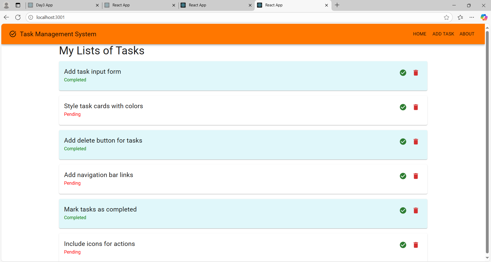
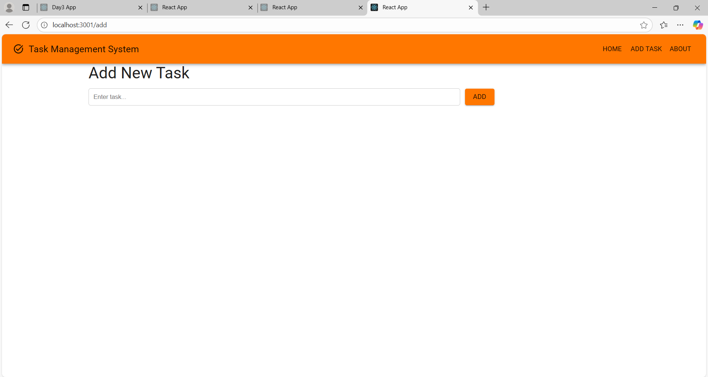
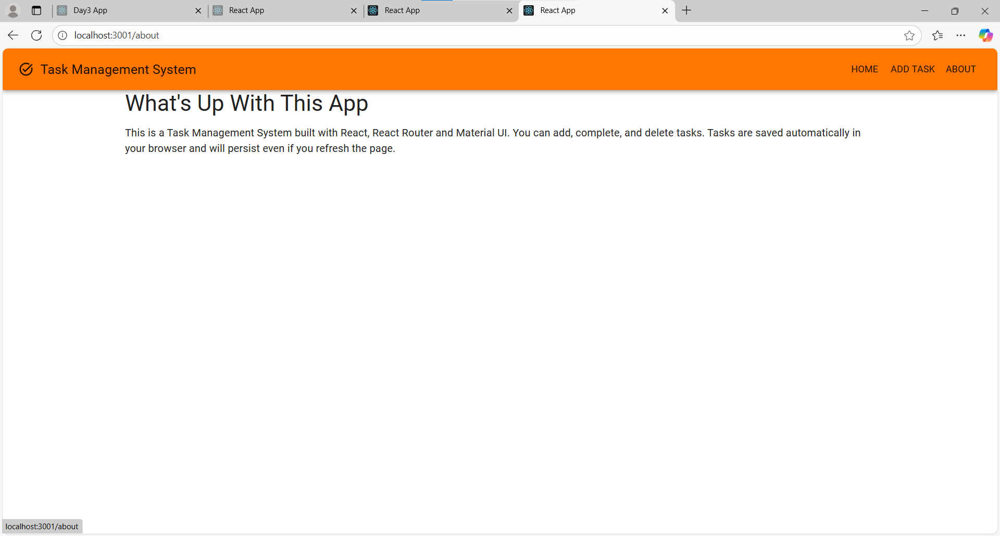

Task Management System - Day 4
Overview

For Day I worked on creating a Task Management System using React, React Router, and Material UI. The main goal was to implement routing, localStorage persistence, polished UI, icons, and theming for the app.

In this project, I wanted the tasks to be manageable: add new tasks, mark them as complete, delete tasks, and see everything in a neat interface.

Features Implemented

Routing

Added Home, Add Task, and About pages using react-router-dom.

Navigation bar lets the user switch between pages easily.

Task Management

Users can add new tasks, mark tasks as completed, and delete tasks.

Tasks are displayed as cards with clear visual distinction for completed vs pending tasks.

Persistence

Tasks are saved in localStorage so they remain after refreshing the page (planned).

UI & Theme

Used Material UI for a clean interface.

Added icons for actions (complete/delete).

Applied a custom theme with primary and secondary colors.

How I Did It

Created a new React project for Day 4 and installed required dependencies:

npm install @mui/material @emotion/react @emotion/styled @mui/icons-material react-router-dom

Set up BrowserRouter in index.js to enable routing.

Built the App.js with:

Navigation bar

Routes for Home, Add Task, About

Task state management (useState)

LocalStorage save/load using useEffect

Styled the app using MUI components like AppBar, Toolbar, Card, Button, Typography, and Stack.

Added icons for task actions (checkmark for complete, trash can for delete).

Added some dummy tasks to test the layout and actions.

Tested the app in browser to make sure navigation, task actions, and layout worked properly.

Screenshots

This is the home page showing all tasks with complete and delete actions.

Here you can add a new task using the input form.

This page gives a brief overview of the Task Management System.

Conclusion

I was able to create a functional and visually neat Task Management System.
I learned how to use React Router for navigation, manage state with React hooks, apply Material UI styling, and handle tasks in a simple way.

The next step would be to fix localStorage persistence fully and maybe add features like filtering tasks by status or priorities.
In the project directory, you can run:

