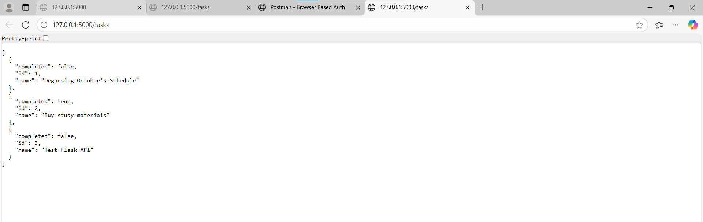

# Week 3 Day 1 – Flask Basics & REST Endpoints

## Topic
**Python Basics | Flask Setup | Project Structure | REST Endpoints (GET & POST)**

---

## Task
- Setup a Flask project and define a proper folder structure (`app`, `routes`, `static`, etc.)
- Create a basic “Hello World” route to confirm Flask is working
- Implement:
  - **GET /tasks** → to fetch all tasks
  - **POST /tasks** → to add a new task
- Use dummy in-memory storage
- Test both routes using **Postman** or **curl**

---

## Steps I Followed

1. **Created the Folder Structure**  
   I opened my `AeroAspire` folder, went to `Week3 > Day1`, and created the base folder setup with subfolders like `app`, `routes`, and `static`.  
   Inside the `Day1` folder, I created an `app.py` file which served as the main entry point for the Flask application.

2. **Installed Flask**  
   In the VS Code terminal, I ran:
   ```bash
   pip install flask

3. **Wrote the Basic Flask Code**

    I began with a simple test code to make sure Flask was installed properly

    from flask import Flask
    app = Flask(__name__)

    @app.route('/')
    def home():
        return "Hello world, Flask is working!"

    if __name__ == '__main__':
        app.run(debug=True)


    Then I executed:

    python app.py


    The browser displayed “Hello world, Flask is working!”, which confirmed my setup worked successfully.

4. **Added Dummy Data and REST Endpoints**

    Next, I added dummy in-memory data to act as tasks and created two routes:

    GET /tasks to fetch all tasks

    POST /tasks to add a new task
    These endpoints returned responses in JSON format.

5. **Tested the Routes Using PowerShell or Postman**

    I tested the APIs using PowerShell commands:

    For GET /tasks, it displayed all dummy tasks in JSON.

    For POST /tasks, I was able to add a new task, which was reflected in the output.
    Both commands returned successful status codes (200 OK), confirming everything worked.

6. **Verified and Took Screenshots**

    Finally, I verified the outputs and took three screenshots for documentation:

    Flask working output (Hello World)

    GET and POST tasks response

    Folder structure inside VS Code

## Screenshots

### Flask is Working


### GET and POST Tasks Output


### Project Folder Structure
