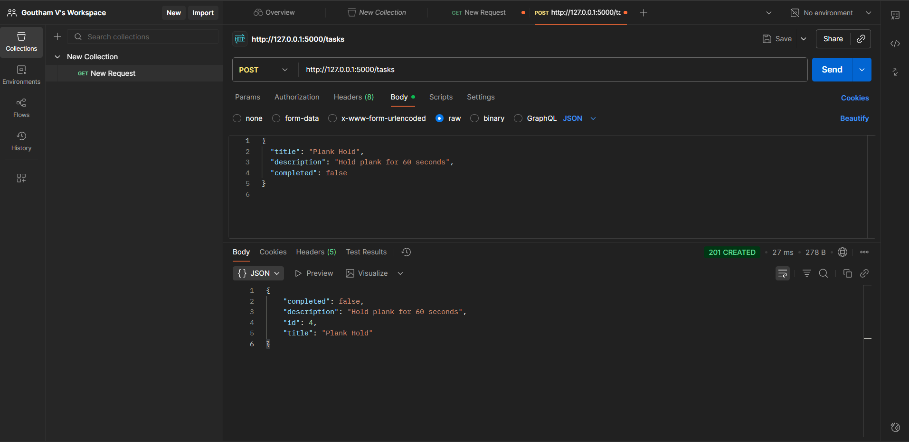
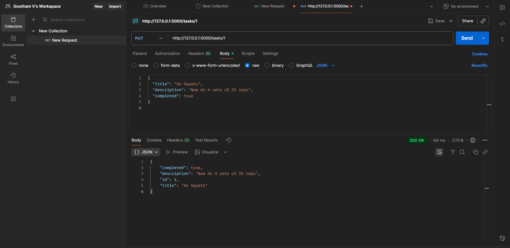
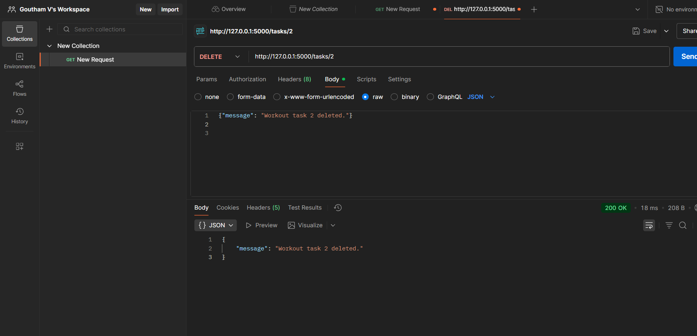

# Workout Task Manager API
### Week 3 - Day 2 | AeroAspire Internship
**Topic:** PUT / DELETE; Parameter Passing; Path vs Query Params
---

## Project Summary
This project is a simple REST API built using Flask in Python. It manages a list of workout tasks.

Tasks i did:

- Added new workout tasks

- Viewed all tasks

- Updated any workout task

- Deleted tasks you no longer need

- Filtered tasks using query parameters (for example, show only completed ones)

## Steps
1. **Create a virtual environment:**

python -m venv venv

2. **Activate it (PowerShell):**

.\venv\Scripts\Activate.ps1

3. **Install Flask:**

pip install flask

4. **Run the app:**

python app.py

5. **Once it runs, copy the URL shown in the terminal (usually http://127.0.0.1:5000/) and open Postman.**

## Testing the API in Postman

1. **GET - Show All Tasks**
URL:
http://127.0.0.1:5000/tasks

This shows all workout tasks.

2. **POST - Add a New Task**
URL:
http://127.0.0.1:5000/tasks

Headers:
Content-Type: application/json

Body (raw → JSON):

json
{
  "title": "Burpees",
  "description": "Do 3 sets of 10 reps",
  "completed": false
}
3. **PUT - Update a Task**
URL:
http://127.0.0.1:5000/tasks/1

Body (raw → JSON):

json
{
  "title": "Do Squats",
  "description": "Complete 4 sets of 20 reps",
  "completed": true
}
4. **DELETE - Remove a Task**
URL:
http://127.0.0.1:5000/tasks/2

This deletes a specific workout task based on its ID.

5. **GET - Filter Completed Tasks**
URL:
http://127.0.0.1:5000/tasks?completed=true

This returns only the tasks marked as completed.

Example API Response
Example of a response when sending a GET request:

json
[
  {
    "id": 1,
    "title": "Do Squats",
    "description": "Complete 4 sets of 20 reps",
    "completed": true
  },
  {
    "id": 2,
    "title": "Lunges and Push-ups",
    "description": "3 sets of lunges and 20 push-ups",
    "completed": false
  }
]
---
## Folder Structure
text
Week3/
└── Day2/
    ├── app.py
    ├── venv/
    ├── README.md
    └── screenshots/
        ├── get.png
        ├── post.png
        ├── put.png
        └── delete.png
---

## Screenshots

 
 ### POST request
 

 ### PUT request
 

 ### DELETE request
 

 ### GET request
 

