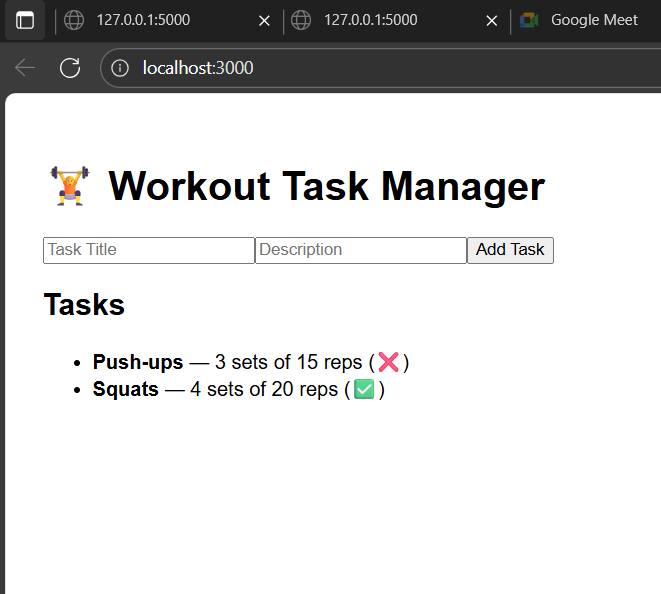

# Week 3 – Day 3: Error Handling, Input Validation, Status Codes, CORS, Frontend Integration

##Task Objective

- To create a Flask backend and connect it with a React frontend while implementing the following:
- Error handling (404, 400)
- Input validation
- Proper HTTP status codes
- Enabling CORS
- Testing endpoints using Postman and the browser

## Steps Followed

### Project Setup
 
- Created a new folder named Week3/Day3.
- Set up a virtual environment in Python using venv.
- Activated the virtual environment.

### Installed Required Dependencies
```bash
Installed Flask for backend development.
Installed Flask-CORS to handle frontend requests.
```

### Created Backend (Flask API)

**Created a file named app.py inside the Day3 folder.**

Added routes for:
```bash
GET → Fetch all tasks
POST → Add a new task
PUT → Update a task
DELETE → Remove a task
```
**Implemented validation for empty task inputs.**
**Added proper status codes for each operation.**
**Added error handlers for 404 and 400 responses.**

### Enabled CORS
```bash
Used flask_cors to allow the React frontend to access the Flask API.
```

### Tested Backend using Postman

**Verified all API endpoints:**
```bash
Method	Endpoint	Description
GET	/tasks	Fetch all tasks
POST	/tasks	Add a new task
PUT	/tasks/:id	Update an existing task
DELETE	/tasks/:id	Delete a task
```

**Confirmed that error responses return proper messages like:**
```bash
“Resource not found”
“Invalid input”
```
### Created React Frontend

- Created a new React app using create-react-app frontend.
- Installed axios for API requests.
- Built a simple UI with input fields and buttons to interact with the Flask API.
- Connected the frontend to the backend using the local Flask server URL.

### Handled Common Issues

- Fixed react-scripts not recognized by reinstalling react-scripts.
- Ensured package.json contained all required dependencies.
- Resolved CORS errors by running both the Flask server and React app simultaneously.

### Final Testing

**Ran Flask backend using:**
```bash
python app.py
```

**Started the React frontend using:**
```bash
npm start
```
---

---
**Verified communication between frontend and backend.**
**Tested all API operations via Postman and the browser interface.**

### Screenshots Taken

GET request in Postman
---

---
POST request in Postman
---

---
PUT request in Postman
---

---
ERROR Handlers
---

---
**React frontend showing task list and new task addition**

### Result
```bash
Successfully implemented:
Error handling (404, 400)
Input validation
Proper status codes
CORS-enabled backend
Fully working frontend-to-backend connection
```
###Technologies Used
```bash
Flask (Backend API)
Flask-CORS (CORS Handling)
React (Frontend Interface)
Axios (HTTP Requests)
Postman (API Testing)
```