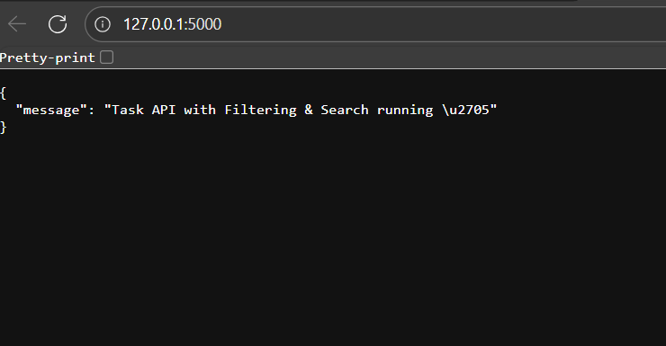
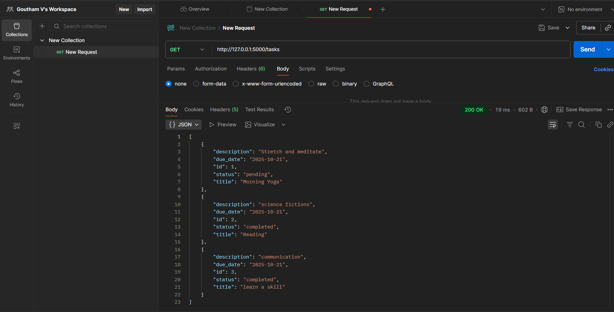
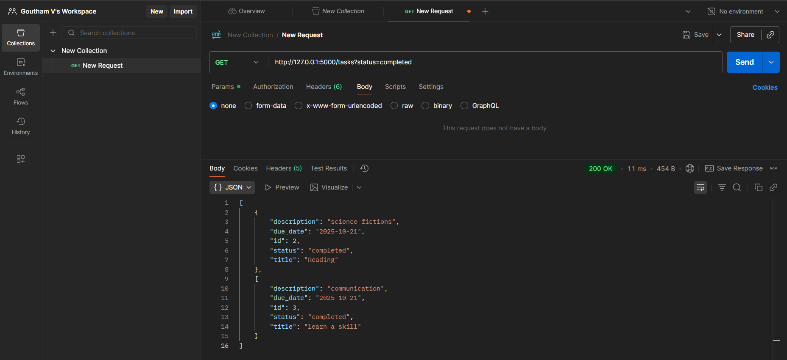
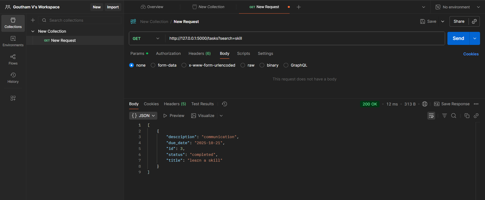
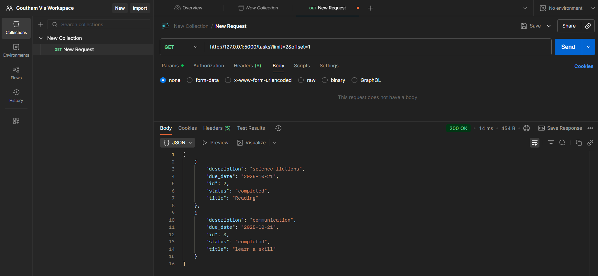

# **Week 4 – Day 3**

---

## **Topic:**  
### *Filtering / Search; Query Parameters; Indexing Basics*

---

## **Task Objective**
*Add filters to the existing Flask API to allow:*
- *Filtering tasks by status (pending / completed)*  
- *Filtering by due_date*  
- *Searching tasks by title*  
- *Optional: basic pagination support for browsing tasks easily*

---

## **Folder Structure**
Week4/
└── Day3/
    ├── app.py
    ├── tasks.db
    ├── venv/
    └── README.md

---

## **Files Description**

### **1 app.py**
* Contains the Flask application integrated with SQLAlchemy.  
* Implements CRUD operations and adds query parameter–based filters and search functionality.*

---

### **2 tasks.db**
* SQLite database that stores the task data, automatically updated through the Flask app.*

---

### **3 venv/**
* Virtual environment that holds dependencies such as Flask and SQLAlchemy.*

---

## **Steps to Run**

### **Step 1 — Activate Virtual Environment**
.\venv\Scripts\Activate.ps1

yaml
Copy code

---

### **Step 2 — Install Required Libraries**
pip install flask flask_sqlalchemy

yaml
Copy code

---

### **Step 3 — Run the Flask App**
python app.py

lua
Copy code

*Expected output:*
Running on http://127.0.0.1:5000

yaml
Copy code

---

## **Step 4 — Use Postman for Testing**

### **1 Add Sample Tasks**
**POST**  
http://127.0.0.1:5000/tasks

css
Copy code

**Body (raw JSON):**
{
"title": "Morning Yoga",
"description": "Stretch and meditate",
"status": "pending",
"due_date": "2025-10-21"
}

yaml
Copy code

Repeat the POST step with different values (e.g. “Evening Run”, “Weight Training”) to add multiple records.

---

### **2 Get All Tasks**
**GET**  
http://127.0.0.1:5000/tasks

yaml
Copy code

---

### **3 Filter Tasks by Status**
**GET**  
http://127.0.0.1:5000/tasks?status=completed

yaml
Copy code

---

### **4 Filter Tasks by Due Date**
**GET**  
http://127.0.0.1:5000/tasks?due_date=2025-10-21

yaml
Copy code

---

### **5 Search Tasks by Title**
**GET**  
http://127.0.0.1:5000/tasks?search=Run

yaml
Copy code

---

### **6 Pagination (Optional)**
**GET**  
http://127.0.0.1:5000/tasks?page=1&limit=2

yaml
Copy code

---

## **Output Examples**

*List of all tasks:*
[
{
"id": 1,
"title": "Morning Yoga",
"description": "Stretch and meditate",
"status": "pending",
"due_date": "2025-10-21"
},
{
"id": 2,
"title": "Reading",
"description": "science fictions",
"status": "completed",
"due_date": "2025-10-21",
}
]

yaml
Copy code

---

## **Screenshots**

### *1 Flask Server Running*

### *2 Tasks Added Using POST Request*

### *3 Filtered Tasks by Status*

### *4 Search Tasks by Title*

### *5 Pagination*

---

## **Outcome**
* Successfully implemented filtering, searching, and pagination features for tasks API.  
* Verified all functionalities via Postman.  
* Learned how to handle query parameters and optimize task retrieval using filters.*

---

## **Learning Summary**
- *Understood query parameter handling in Flask*  
- *Learned how to use SQLAlchemy filter methods for search and filtering*  
- *Practiced using Postman for endpoint validation*

---