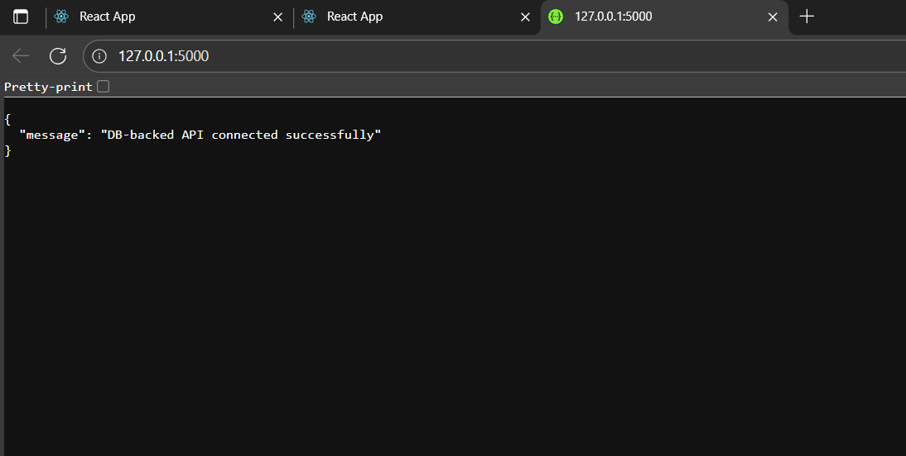
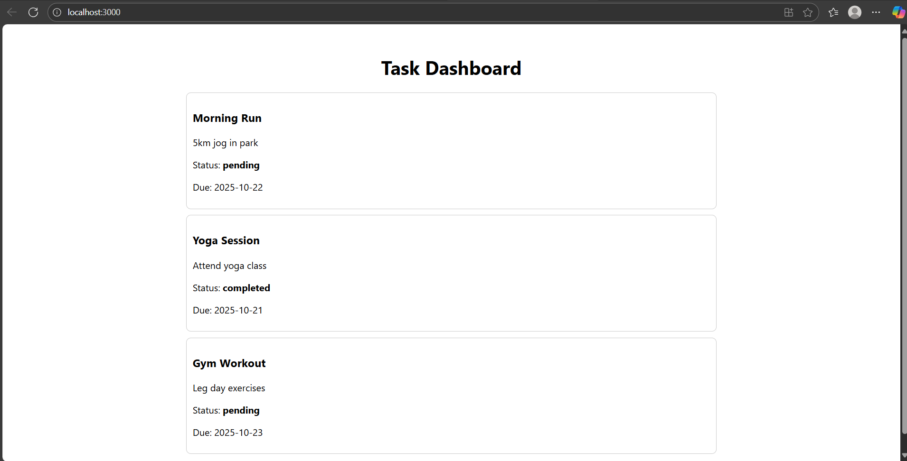

# Week 4 – Day 5  
## Topic: Frontend Connection and Error Handling

### **Task**
Connect the React app to a database-backed Flask API.  
Handle edge cases such as:
- No data (blank tasks)
- Database connection errors

---

## **Steps Followed**

### **1. Setting up the Backend**
1. Created a folder named `backend/`.

2. Installed the required dependencies:
   ```bash
   pip install flask flask_sqlalchemy flask_cors
   
3. Added a file named app.py containing:

Flask and SQLAlchemy configuration

A Task model with columns: id, title, description, status, and due_date

A route /tasks to fetch data from the database

Error handling for any database connection issues

4. Initialized the database:

bash
Copy code
python app.py
This created the tasks.db file and inserted some sample task data.

### **2. Setting up the Frontend**
1. Created a React app inside the frontend/ folder:

bash
Copy code
npx create-react-app frontend

2. Installed Axios for making API requests:

bash
Copy code
npm install axios

3. Created the following components:

App.jsx — main entry file

TaskList.jsx — displays tasks fetched from the backend

Included proper error and empty-data handling

4. Started the frontend:

bash
Copy code
npm start
Confirmed the connection to the backend at http://127.0.0.1:5000/tasks.

### **3. Edge Case Handling**
- When no tasks are available → shows a message “No tasks available”

- When the database is down or not reachable → shows a message “Unable to fetch tasks”

- When data is available → displays the list of tasks properly on the screen

Screenshots
Screenshot 1 – Flask Server Running

This shows the backend server running successfully on port 5000.

Screenshot 2 – React App Displaying Tasks

This shows the React frontend displaying tasks fetched from the backend.

Outcome
- Connected the React frontend with a Flask backend that uses a real database

- Implemented error handling for both frontend and backend

- Handled empty data and database connection errors properly

- Verified everything with screenshots and local testing