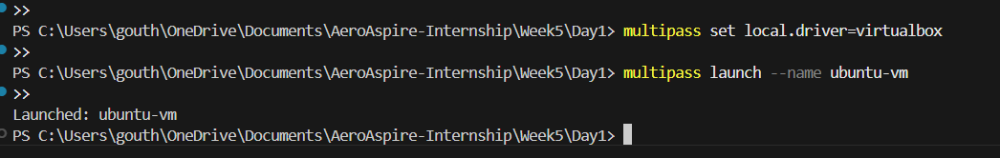
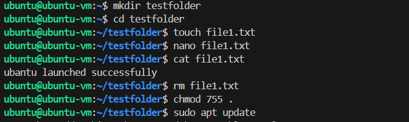
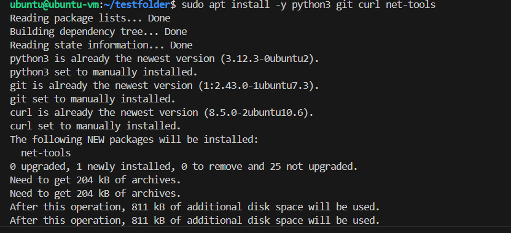
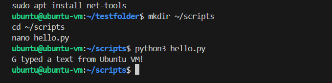
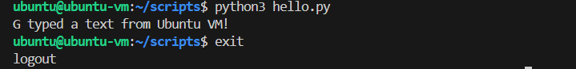

# Week 5 – Day 1
## Topic: Linux Basics + Multipass Setup
### Task:
Install Multipass, launch Ubuntu VM, SSH into VM, practice basic CLI commands (ls, cd, touch, nano, rm, chmod, sudo), install Python, Git, curl, net-tools, create a simple folder, and run a Python script inside the VM.

---

## **Steps I Followed**

### * Step 1 — Installed Multipass & VirtualBox*
* Verified installation with:
multipass version
### * Step 2 — Launched Ubuntu VM*

Launched VM using:

multipass launch --name ubuntu-vm
Verified VM is created successfully:

Launched: ubuntu-vm

### * Step 3 — SSH into VM*

Entered the VM shell:

multipass shell ubuntu-vm

Terminal prompt changed to:

ubuntu@ubuntu-vm:~$

### * Step 4 — Practiced basic Linux commands*

Created folders and files:

mkdir testfolder
cd testfolder
touch demo.txt
nano demo.txt
ls
pwd

Edited demo.txt using nano, viewed content using cat

Verified file permissions using chmod and removed files with rm

### * Step 5 — Installed essential tools*

Installed Python, Git, curl, net-tools:

sudo apt update
sudo apt install -y python3 git curl net-tools

Verified installation:

python3 --version
git --version
curl --version
ifconfig

### * Step 6 — Created and ran a Python script*

Created scripts folder and Python file:

mkdir ~/scripts
cd ~/scripts
nano hello.py

Python code inside hello.py:

print("Hello from Ubuntu VM!")

Run the script:

python3 hello.py

Output:

Hello from Ubuntu VM!

### * Step 7 — Verified VM status and exited*

exit
multipass list

